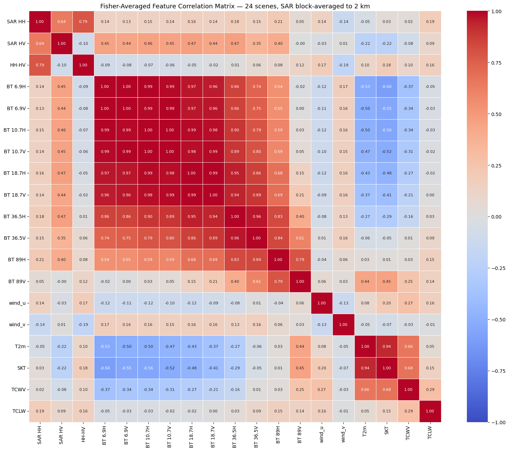
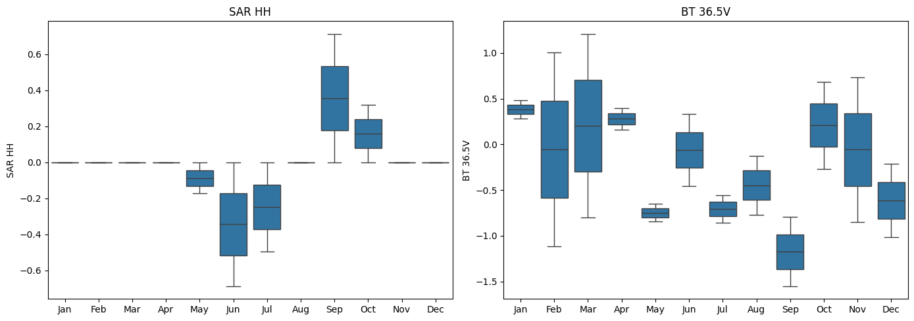

# Dataset Exploration

This document summarises findings from exploratory data analysis of the AI4Arctic Sea Ice Challenge dataset. The dataset pairs Sentinel-1 SAR (radar) imagery with passive microwave brightness temperatures and weather reanalysis data, with the goal of training a model to map sea ice from satellite imagery.

Two formats of the same data were explored: the original **raw** files and the preprocessed **Ready-To-Train (RTT)** format.

Notebooks: [`eda-raw-data.ipynb`](../../notebooks/eda-raw-data.ipynb) · [`eda-rtt-data.ipynb`](../../notebooks/eda-rtt-data.ipynb)

---

## What the data contains

Each file covers one Sentinel-1 overpass (a single swath of radar imagery). Three types of variables are present:

| Source | Variables | Grid size | What it measures |
|---|---|---|---|
| Sentinel-1 SAR | HH, HV backscatter, incidence angle | ~5000×5000 px (80 m) | Radar return from the surface — sensitive to ice roughness and volume scattering |
| AMSR2 (passive microwave) | Brightness temperatures at 8 frequencies × 2 polarisations | 200×209 (2 km) | Microwave emission from the surface — directly sensitive to ice concentration |
| ERA5 (weather reanalysis) | Wind, air temperature, humidity | 200×209 (2 km) | Atmospheric conditions at the time of acquisition |

The ice chart labels — **SIC** (Sea Ice Concentration), **SOD** (Stage of Development), and **FLOE** (Floe Size) — are encoded in `polygon_icechart` in the raw files only. They are drawn by ice analysts and represent the ground truth the model is trained to predict.

---

## Raw vs RTT: what changed in preprocessing

The RTT format is designed to be model-ready. Compared to the raw files:

- **File size drops ~5×** (2 GB → 422 MB) by halving the SAR resolution, dropping the ice chart and sparse grid vectors, and converting ERA5/AMSR2 from float64 to float32.
- **All values are normalised** to approximately zero mean using statistics computed across the full training set. A winter scene will have negative TCWV and TCLW values because that scene is drier than the dataset average — this is expected, not an error.
- **Incidence angle is upgraded** from a sparse 441-point lookup grid to a full-resolution image (`sar_incidenceangle`, same shape as SAR). This makes it usable as a per-pixel feature.
- **The ice chart labels are dropped.** Training requires either re-merging the raw `polygon_icechart` or using the separate label files from the AI4Arctic challenge.

| Property | Raw | RTT |
|---|---|---|
| File size | ~2 GB | ~422 MB |
| SAR resolution | 10006×10458 | 5003×5229 |
| Values | Physical units (dB, K, m/s) | Normalised (~zero mean) |
| Ice chart labels | Present (`polygon_icechart`) | Dropped |
| Incidence angle | Sparse 441-point vector | Full 5003×5229 image |

---

## Key findings

### SAR backscatter

- HH mean −15.2 dB, HV mean −25.7 dB in the January 2018 test scene. The ~10 dB gap between polarisations is typical for sea ice — open water returns very little cross-polarised (HV) energy, while ice volume scattering raises HV closer to HH.
- The wide dynamic range (−83 to +28 dB) reflects the scene containing a mix of open water, ice edge, and consolidated ice.

### Brightness temperatures (AMSR2)

- Values range from ~79 K to ~258 K across all channels, increasing with frequency. Higher-frequency channels (89 GHz) are warmer on average.
- Within each frequency, H-polarisation is consistently lower than V-polarisation. This is a physical property of most surfaces: vertical polarisation emits more efficiently.
- The spread of values across the 200×209 grid reflects the scene's mix of ice types and open water, each with different emission properties.

### Weather variables (ERA5)

- Air temperature ~271 K (−2°C), skin temperature ~273 K (0°C) — near-freezing, consistent with January in the Arctic.
- Very low humidity (TCWV ~4.7 kg/m²) and negligible cloud liquid water (TCLW ~0.002 kg/m²) — a dry, clear-sky arctic airmass.
- Wind components are light and largely uncorrelated with the surface variables.

### Sea ice concentration (SIC) distribution

The `polygon_icechart` labels were decoded using the `polygon_codes` coordinate, which maps each polygon ID to WMO ice chart attributes. The CT (total concentration) field uses a 0–10 scale where 0 = open water and 10 = fully ice-covered.

The January 2018 scene is predominantly ice-covered, which is consistent with winter conditions in the Denmark Strait / East Greenland region. Class imbalance is visible — a few concentration classes dominate while others are sparse. This is important to account for during model training (e.g. weighted loss or stratified sampling).

### Feature correlations

All correlation analysis uses **block averaging** to bring SAR down to the 2 km AMSR2 grid: each output value is the mean of a ~25×25 pixel SAR patch. This matters because correlating a single noisy 160 m pixel against a 2 km averaged brightness temperature understates the true relationship — the noise in a single pixel inflates variance without contributing any shared signal. Block averaging suppresses speckle and makes the spatial scales physically comparable.

**Input–input correlations (single scene and averaged across 24 scenes):**
- Brightness temperatures are strongly intercorrelated (r > 0.9 between adjacent channels). They are all measuring the same underlying surface emission at slightly different frequencies.
- T2m (air temperature) and SKT (skin temperature) are nearly identical (r ≈ 0.99). They can be treated as redundant.
- T2m and TCWV are also highly correlated — colder air holds less moisture, so they covary seasonally.
- SAR HH and HV show moderate correlation with BT channels and weak correlation with ERA5 variables.
- Wind speed is largely decorrelated from everything else.
- TCLW is nearly constant in this scene (range 0–0.02 kg/m²) and carries almost no information.

**The correlation structure is stable across the training set.** A Fisher z-transform average over 24 scenes (2 per month, 2018–2021) shows the same block structure as the single-scene result, confirming these are physics-driven relationships rather than scene-specific artefacts.

**Feature–SIC correlations:**
- BT channels and SAR both show meaningful correlation with ice concentration when compared at the same 2 km spatial scale.
- V-polarisation BT channels tend to have stronger SIC correlation than H-pol at the same frequency, consistent with their higher sensitivity to surface emissivity differences between ice and water.

### Seasonal feature distributions

The 24-scene sample (2 scenes per month, drawn from 2018–2021) was used to plot how two key features — SAR HH backscatter and BT 36.5V brightness temperature — shift across the calendar year.

**BT 36.5V** is one of the best indicators of sea ice in the AMSR2 suite. Sea ice emits microwave radiation much more strongly than open water at this frequency (emissivity ~0.92 vs ~0.65), so higher brightness temperatures mean more ice coverage. Winter months show higher, tighter values; summer months show lower values with more spread as melting introduces a patchwork of ice and open water within each scene.

**SAR HH** tends to be higher and more consistent in winter, when consolidated ice dominates (rougher surface, stronger volume scattering). Summer months show lower or more variable values as open water appears — a near-specular, low-backscatter surface.

Since only 2 scenes per month are in the sample, each box in the plot represents just two points. The plots are best read as a directional trend rather than a full statistical distribution.

**Why this matters for training:** both features shift substantially between seasons. If the train/validation split is not stratified by month, a model could learn seasonal proxies (e.g. "low BT 36.5V → winter → high ice") instead of the actual surface physics. Seasons should be balanced on both sides of any split.

### Incidence angle effect on SAR backscatter

SAR backscatter depends on incidence angle — steeper viewing angles (near range, ~19°) produce stronger returns than shallower angles (far range, ~47°), independently of what's on the surface. The RTT `sar_incidenceangle` image makes it possible to quantify this directly. A clear linear trend is visible in both HH and HV: the slope represents a geometric effect that the model will need to account for, either by including incidence angle as a feature or by correcting the SAR values before training.

---

## Dataset-level notes

- **475 total training scenes** spanning 2018–2021. Monthly counts are unequal — August and September have roughly twice as many scenes as February and March. This seasonal imbalance means the model will see more open-water and melt-season examples than consolidated winter ice.
- **`amsr2_swath_map` is all NaN** in the examined scene. When there is no direct AMSR2 overpass, the brightness temperatures come from a gridded interpolation product rather than a direct measurement. The fraction of training scenes in this condition is unknown and worth checking.

