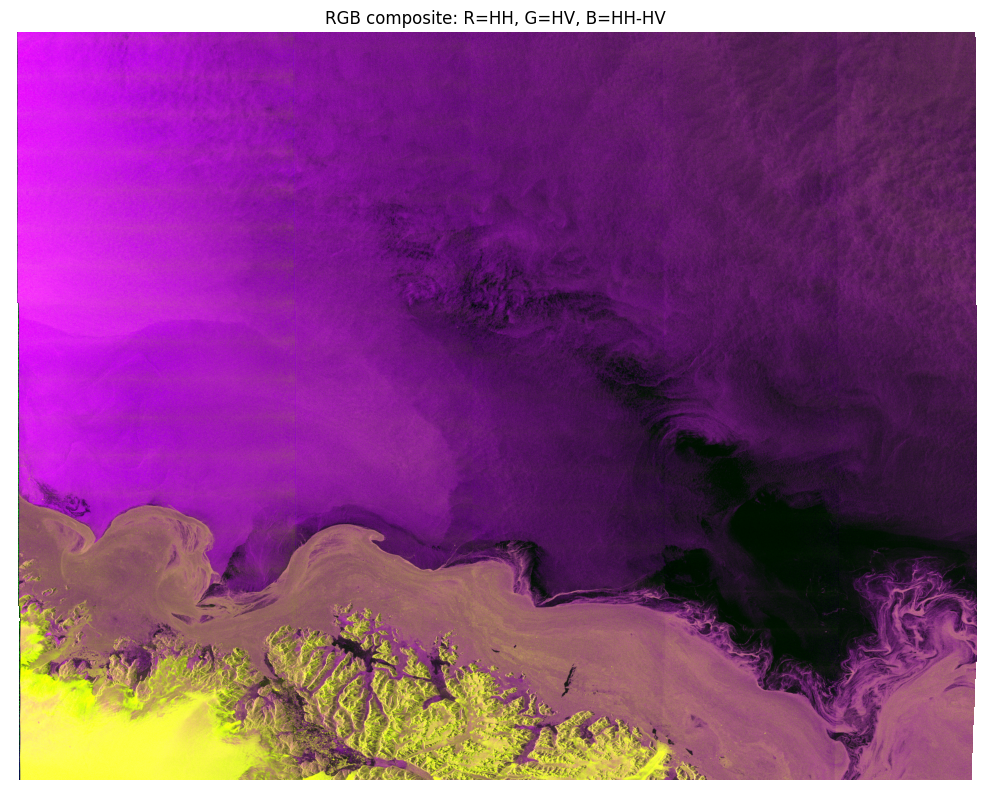
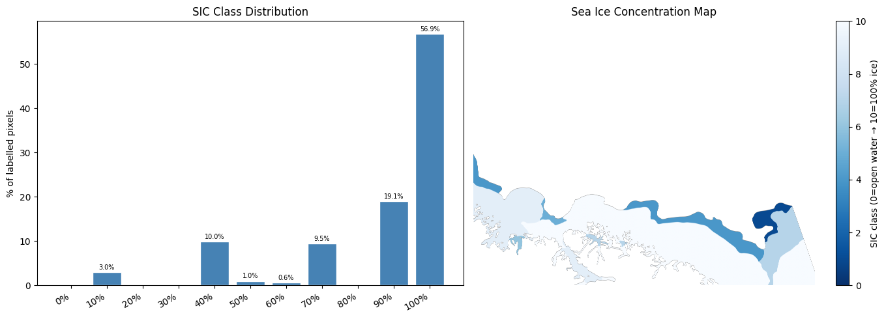
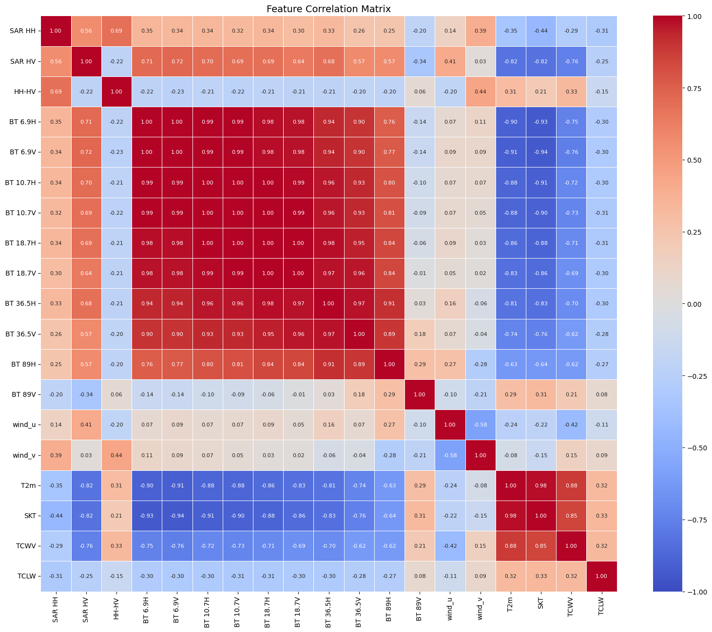
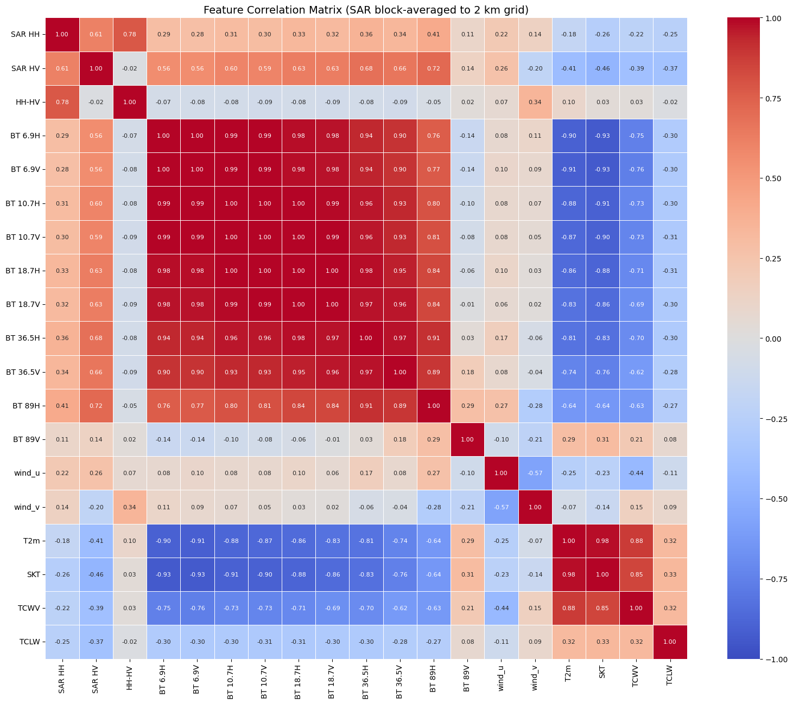
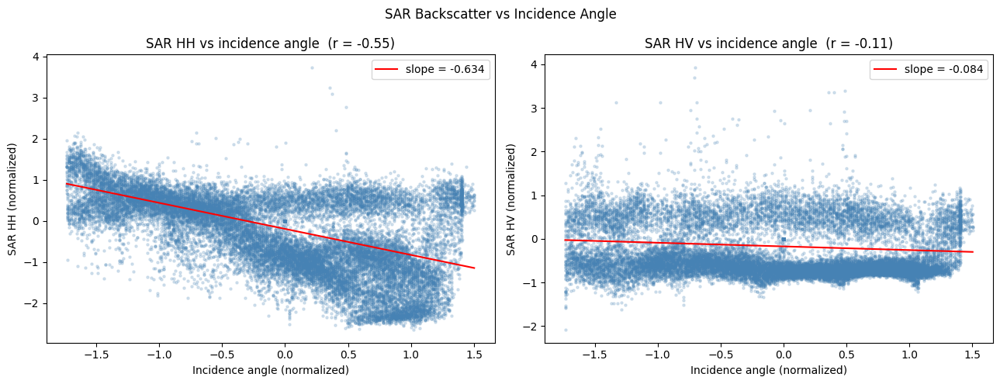

# Dataset Exploration

This document summarises findings from exploratory data analysis of the AI4Arctic Sea Ice Challenge dataset. The dataset pairs Sentinel-1 SAR (radar) imagery with passive microwave brightness temperatures and weather reanalysis data, with the goal of training a model to map sea ice from satellite imagery.

Two formats of the same data were explored: the original **raw** files and the preprocessed **Ready-To-Train (RTT)** format.

Notebooks: [`eda-raw-data.ipynb`](../../notebooks/eda-raw-data.ipynb) · [`eda-rtt-data.ipynb`](../../notebooks/eda-rtt-data.ipynb)

---

## What the data contains

Each file covers one Sentinel-1 overpass (a single swath of radar imagery). Three types of variables are present:

| Source | Variables | What it measures |
|---|---|---|
| Sentinel-1 SAR | HH, HV backscatter, incidence angle | Radar return from the surface — sensitive to ice roughness and volume scattering |
| AMSR2 (passive microwave) | Brightness temperatures at 8 frequencies × 2 polarisations | Microwave emission from the surface — directly sensitive to ice concentration |
| ERA5 (weather reanalysis) | Wind, air temperature, humidity | Atmospheric conditions at the time of acquisition |

The ice chart labels — **SIC** (Sea Ice Concentration), **SOD** (Stage of Development), and **FLOE** (Floe Size) — are encoded in `polygon_icechart` in the raw files only. They are drawn by ice analysts and represent the ground truth the model is trained to predict.

---

## Raw vs RTT: overview

The RTT format is designed to be model-ready. For the analysis, a single scene is observed:
RAW: `S1A_EW_GRDM_1SDH_20180124T194759_20180124T194859_020301_022AA4_1F75_icechart_dmi_201801241950_SouthEast_RIC.nc`
RTT: `20180124T194759_dmi_prep.nc`

Compared to the raw files:

- **File size drops ~5×** (2 GB → 422 MB) by halving the SAR resolution, dropping the ice chart and sparse grid vectors, and converting ERA5/AMSR2 from float64 to float32.
- **All values are normalised** to approximately zero mean using statistics computed across the full training set. A winter scene will have negative TCWV and TCLW values because that scene is drier than the dataset average.
- **Incidence angle is upgraded** from a sparse 441-point lookup grid to a full-resolution image (`sar_incidenceangle`, same shape as SAR). This makes it usable as a per-pixel feature.
- **The ice chart labels are processed.** Training requires using the processed variables from the AI4Arctic challenge.

| Property | Raw | RTT |
|---|---|---|
| File size | ~2 GB | ~422 MB |
| SAR resolution | 10006×10458 | 5003×5229 |
| Values | Physical units (dB, K, m/s) | Normalised (~zero mean) |
| Ice chart labels | Unprocessed `polygon_icechart` and `ploygon_codes` LUT | Processed variables |
| Incidence angle | Sparse 441-point vector | Full 5003×5229 image |

---

## Raw vs RTT: feature comparison

| Variable | Meaning | Raw Shape | Raw Mean | Raw Min | Raw Max | RTT Shape | RTT Mean | RTT Min | RTT Max |
|---|---|---|---|---|---|---|---|---|---|
| `nersc_sar_primary` | Sentinel-1 image in HH polarization | (10006, 10458) | -15.22 | -83.149 | 19.607 | (5003, 5229) | 0.723 | -9.39 | 4.624 |
| `nersc_sar_secondary` | Sentinel-1 image in HV polarization | (10006, 10458) | -25.66 | -83.462 | 27.609 | (5003, 5229) | 0.466 | -6.158 | 8.201 |
| `polygon_icechart` | Ice chart polygon IDs in Sentinel-1 grid | (10006, 10458) | 25.90 | 3 | 31 | — | — | — | — |
| `distance_map` | Distance to land zones (ids 0–41) | (10006, 10458) | 29.04 | 0 | 41 | (5003, 5229) | 0.838 | -1.576 | 1.159 |
| `sar_grid_line` | Line number of the 441 SAR geographic grid points | (441,) | 5009.29 | 0 | 10005 | — | — | — | — |
| `sar_grid_sample` | Sample number of the 441 SAR geographic grid points | (441,) | 5229.86 | 0 | 10457 | — | — | — | — |
| `sar_grid_latitude` | Latitude of the 441 SAR geographic grid points | (441,) | 64.70 | 62.497 | 66.858 | — | — | — | — |
| `sar_grid_longitude` | Longitude of the 441 SAR geographic grid points | (441,) | -35.20 | -40.704 | -30.235 | — | — | — | — |
| `sar_grid_incidenceangle` | Incidence angle — affects radar backscatter cross-section | (441,) | 33.98 | 19.111 | 46.712 | — | — | — | — |
| `sar_grid_height` | Height above sea level for the 441 SAR geographic grid points | (441,) | 0 | 0 | 0 | — | — | — | — |
| `btemp_6_9h` | AMSR2 brightness temperature at 6.9 GHz, horizontal polarization | (200, 209) | 118.16 | 79.148 | 234.367 | (200, 209) | 0.855 | -1.131 | 1.387 |
| `btemp_6_9v` | AMSR2 brightness temperature at 6.9 GHz, vertical polarization | (200, 209) | 184.52 | 159.102 | 253.656 | (200, 209) | 0.833 | -1.149 | 1.297 |
| `btemp_7_3h` | AMSR2 brightness temperature at 7.3 GHz, horizontal polarization | (200, 209) | 119.35 | 80.367 | 235.328 | (200, 209) | 0.853 | -1.127 | 1.385 |
| `btemp_7_3v` | AMSR2 brightness temperature at 7.3 GHz, vertical polarization | (200, 209) | 185.06 | 159.398 | 254.078 | (200, 209) | 0.834 | -1.159 | 1.29 |
| `btemp_10_7h` | AMSR2 brightness temperature at 10.7 GHz, horizontal polarization | (200, 209) | 123.00 | 83.266 | 240.656 | (200, 209) | 0.871 | -1.16 | 1.425 |
| `btemp_10_7v` | AMSR2 brightness temperature at 10.7 GHz, vertical polarization | (200, 209) | 190.80 | 166.828 | 256.352 | (200, 209) | 0.841 | -1.161 | 1.309 |
| `btemp_18_7h` | AMSR2 brightness temperature at 18.7 GHz, horizontal polarization | (200, 209) | 134.89 | 96.609 | 243.875 | (200, 209) | 0.914 | -1.313 | 1.486 |
| `btemp_18_7v` | AMSR2 brightness temperature at 18.7 GHz, vertical polarization | (200, 209) | 202.14 | 183.188 | 256.266 | (200, 209) | 0.864 | -1.262 | 1.343 |
| `btemp_23_8h` | AMSR2 brightness temperature at 23.8 GHz, horizontal polarization | (200, 209) | 150.43 | 113.406 | 246.945 | (200, 209) | 0.983 | -1.604 | 1.509 |
| `btemp_23_8v` | AMSR2 brightness temperature at 23.8 GHz, vertical polarization | (200, 209) | 210.39 | 193.383 | 256.094 | (200, 209) | 0.899 | -1.493 | 1.343 |
| `btemp_36_5h` | AMSR2 brightness temperature at 36.5 GHz, horizontal polarization | (200, 209) | 161.81 | 129.18 | 249.172 | (200, 209) | 0.977 | -1.449 | 1.656 |
| `btemp_36_5v` | AMSR2 brightness temperature at 36.5 GHz, vertical polarization | (200, 209) | 218.92 | 206.727 | 255.141 | (200, 209) | 0.825 | -1.217 | 1.526 |
| `btemp_89_0h` | AMSR2 brightness temperature at 89.0 GHz, horizontal polarization | (200, 209) | 194.60 | 166.32 | 249.875 | (200, 209) | 0.964 | -2.046 | 1.653 |
| `btemp_89_0v` | AMSR2 brightness temperature at 89.0 GHz, vertical polarization | (200, 209) | 239.75 | 193.758 | 257.781 | (200, 209) | 0.366 | -2.912 | 1.013 |
| `amsr2_swath_map` | Map of integers indicating which pixels belong to which AMSR2 swath | (200, 209) | — | — | — | — | — | — | — |
| `swath_segmentation` | Segmentation mask for individual AMSR2 swath passes | (200, 209) | 0 | 0 | 0 | — | — | — | — |
| `u10m_rotated` | ERA5 eastward 10m wind rotated to Sentinel-1 flight direction | (200, 209) | 1.43 | -3.622 | 12.804 | (200, 209) | 0.560 | -0.905 | 2.554 |
| `v10m_rotated` | ERA5 northward 10m wind rotated to Sentinel-1 flight direction | (200, 209) | -0.40 | -10.196 | 8.721 | (200, 209) | 0.793 | -2.079 | 1.561 |
| `t2m` | ERA5 2m air temperature | (200, 209) | 271.29 | 252.765 | 275.5 | (200, 209) | 0.525 | -1.675 | 0.726 |
| `skt` | ERA5 skin temperature | (200, 209) | 272.96 | 247.483 | 279.294 | (200, 209) | 0.777 | -2.079 | 1.008 |
| `tcwv` | ERA5 total column water vapour | (200, 209) | 4.68 | 1.747 | 5.823 | (200, 209) | 0.179 | -1.139 | -0.365 |
| `tclw` | ERA5 total column cloud liquid water | (200, 209) | 0.002 | 0 | 0.021 | (200, 209) | 0.042 | -0.58 | -0.291 |

---

## Key findings
### SAR backscatter - Raw

- HH mean −15.2 dB, HV mean −25.7 dB in the January 2018 test scene. The ~10 dB gap between polarisations is typical for sea ice — open water returns very little cross-polarised (HV) energy, while ice volume scattering raises HV closer to HH (Natural Resources Canada, [2025](https://natural-resources.canada.ca/maps-tools-publications/satellite-elevation-air-photos/sea-ice-applications)).
- The wide dynamic range (−83 to +28 dB) reflects the scene containing a mix of open water, ice edge, and consolidated ice.

### Brightness temperatures (AMSR2) - Raw

- Values range from ~79 K to ~258 K across all channels, increasing with frequency. Higher-frequency channels (89 GHz) are warmer on average (Meier et al., [2017](https://nsidc.org/sites/default/files/amsr2_seaice_atbd_v2.pdf)).
- Within each frequency, H-polarisation is consistently lower than V-polarisation.
- The spread of values across the 200×209 grid reflects the scene's mix of ice types and open water, each with different emission properties.

### Weather variables (ERA5) - Raw

- Air temperature ~271 K (−2°C), skin temperature ~273 K (0°C) — near-freezing, consistent with January in the Arctic.
- Very low humidity (TCWV ~4.7 kg/m²) and negligible cloud liquid water (TCLW ~0.002 kg/m²) — a dry, clear-sky arctic airmass.
- Wind components are light and largely uncorrelated with the surface variables.

### Sea ice concentration (SIC) distribution - Raw

The `polygon_icechart` labels were decoded using the `polygon_codes` coordinate, which maps each polygon ID to WMO ice chart attributes. The CT (total concentration) field uses a 0–10 scale where 0 = open water and 10 = fully ice-covered. The x-axis in the distribution represent the percentage of sea ice coverage based on the 0-10 scale.

The January 2018 scene is predominantly ice-covered, which is consistent with winter conditions in the Denmark Strait / East Greenland region. Class imbalance is visible — a few concentration classes dominate while others are sparse. This is important to account for during model training (e.g. weighted loss or stratified sampling).

### Feature correlations

All correlation analysis uses **block averaging** to bring SAR down to the 2 km AMSR2 grid: each output value is the mean of a ~25×25 pixel SAR patch. This matters because correlating a single noisy 160 m pixel against a 2 km averaged brightness temperature understates the true relationship — the noise in a single pixel inflates variance without contributing any shared signal. Block averaging suppresses speckle and makes the spatial scales physically comparable.

**Raw data correlation matrix on single scene from 10/24/2018**

**RTT data correlation matrix on single scene from 10/24/2018**

- Brightness temperatures are strongly intercorrelated (r > 0.9 between adjacent channels). They are all measuring the same underlying surface emission at slightly different frequencies.
- btemp_89_0h/v. 89 GHz is high resolution and very sensitive to SIC, though it's also more affected by atmospheric noise (tcwv and tclw become relevant as corrections).
- T2m (air temperature) and SKT (skin temperature) are nearly identical (r ≈ 0.99). They can be treated as redundant.
- T2m and TCWV are also highly correlated — colder air holds less moisture, so they covary seasonally.
- SAR HH and HV show moderate correlation with BT channels and weak correlation with ERA5 variables.
- Wind speed is largely decorrelated from everything else.
- TCLW is nearly constant in this scene (range 0–0.02 kg/m²) and carries almost no information.

**RTT Input–input correlations (single scene and averaged across 24 scenes):** a Fisher z-transform average over 24 scenes (2 per month, 2018–2021).

**The correlation structure is stable across the training set.** A Fisher z-transform average over 24 scenes (2 per month, 2018–2021) shows the same block structure as the single-scene result, confirming these are physics-driven relationships rather than scene-specific artefacts.

**Feature–SIC correlations:**
- BT channels and SAR both show meaningful correlation with ice concentration when compared at the same 2 km spatial scale.
- V-polarisation BT channels tend to have stronger SIC correlation than H-pol at the same frequency, consistent with their higher sensitivity to surface emissivity differences between ice and water.

### Seasonal feature distributions - RTT

The 24-scene sample (2 scenes per month, drawn from 2018–2021) was used to plot how two key features — SAR HH backscatter and BT 36.5V brightness temperature — shift across the calendar year.

The scenes per month were selected randomly to analyze a variety of scenes over the seasons and years.

**BT 36.5V** is one of the best indicators of sea ice in the AMSR2 suite (Windnagel et al., [2026](https://www.ncei.noaa.gov/pub/data/sds/cdr/CDRs/Sea_Ice_Concentration/AlgorithmDescription_01B-11.pdf)). Sea ice emits microwave radiation much more strongly than open water at this frequency (emissivity ~0.92 vs ~0.65), so higher brightness temperatures mean more ice coverage. Winter months show higher, tighter values; summer months show lower values with more spread as melting introduces a patchwork of ice and open water within each scene.

**SAR HH** tends to be higher and more consistent in winter, when consolidated ice dominates (rougher surface, stronger volume scattering). Summer months show lower or more variable values as open water appears — a near-specular, low-backscatter surface.

Since only 2 scenes per month are in the sample, each box in the plot represents just two points. The plots are best read as a directional trend rather than a full statistical distribution.

**Why this matters for training:** both features shift substantially between seasons. If the train/validation split is not stratified by month, a model could learn seasonal proxies (e.g. "low BT 36.5V → winter → high ice") instead of the actual surface physics. Seasons should be balanced on both sides of any split.

### Incidence angle effect on SAR backscatter - RTT

SAR backscatter depends on incidence angle — steeper viewing angles (near range, ~19°) produce stronger returns than shallower angles (far range, ~47°), independently of what's on the surface. The RTT `sar_incidenceangle` image makes it possible to quantify this directly. A clear linear trend is visible in both HH and HV: the slope represents a geometric effect that the model will need to account for, either by including incidence angle as a feature or by correcting the SAR values before training.

---

## Dataset-level notes

- **512 total training scenes** spanning 2018–2021. Monthly counts are unequal — August and September have roughly twice as many scenes as February and March. This seasonal imbalance means the model will see more open-water and melt-season examples than consolidated winter ice.
- **`amsr2_swath_map` is all NaN** in the examined scene. When there is no direct AMSR2 overpass, the brightness temperatures come from a gridded interpolation product rather than a direct measurement. The fraction of training scenes in this condition is unknown and worth checking.

